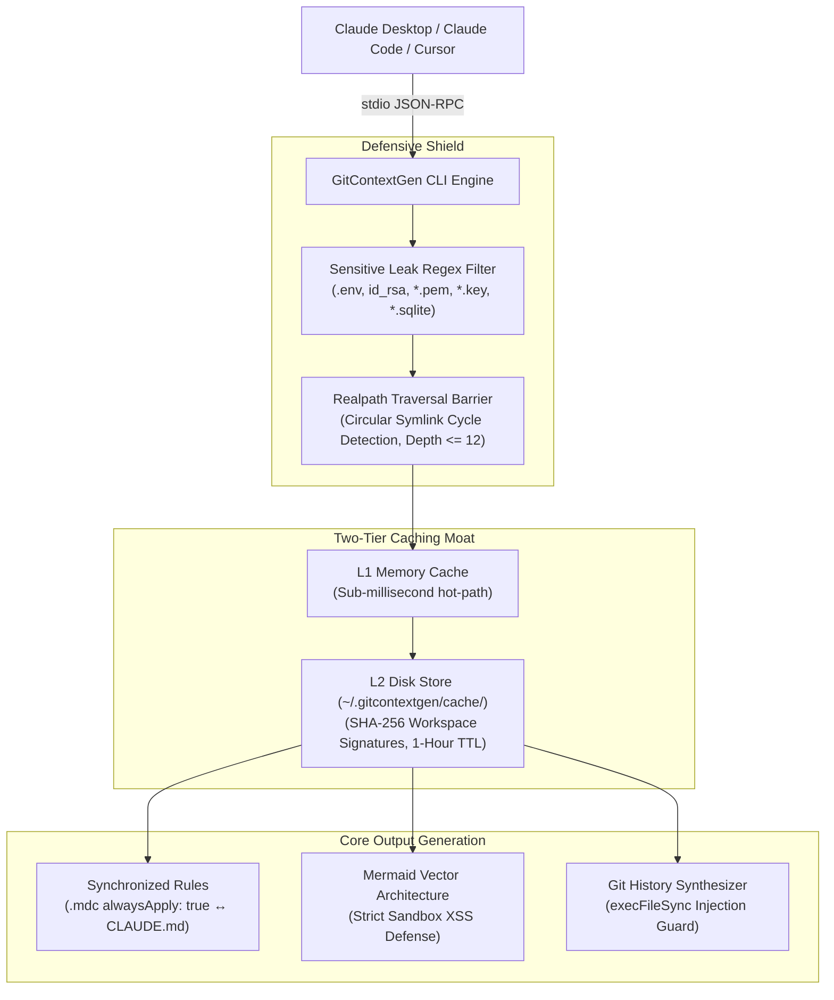

# ⚡ GitContextGen

> **The Universal AI Codebase Context Engine & Local MCP Server for Cursor, Claude Code, Copilot & Windsurf.**  
> *Stop fighting your AI co-pilots. Eliminates Context Debt, unifies fragmented rule files (`CLAUDE.md` ↔ `.cursor/rules/*.mdc`), and exposes your codebase over a zero-latency, local-first stdio Model Context Protocol (MCP) server.*

---

[](LICENSE)
[](https://www.npmjs.com/package/@gitcontextgen/core)
[](https://modelcontextprotocol.io/)
[](https://nextjs.org/)
[](https://repopulse-ai.singhnaveen360.workers.dev)
[](https://github.com/Naveen071110/gitcontextgen/actions)

---

## 💥 The Problem: The "Context Debt Crisis"

AI coding models (Claude 3.7 Sonnet, Claude Code CLI, Cursor Composer, GitHub Copilot) are only as effective as the context you feed them. When developers point AI agents at a raw codebase, three catastrophic failures occur:

1. **Context Window Exhaustion & Blind Grepping**: Agents run blind recursive scans, stuffing thousands of lines of irrelevant dependencies and build caches into the context window, burning through token budgets in minutes.
2. **Rule Fragmentation & Silent Hallucination**: You maintain a `CLAUDE.md` for CLI workflows and `.cursorrules` for editor prompts. They drift immediately. Worse, Cursor 0.40+ silently ignores flat `.cursorrules` in Composer mode unless migrated to `.cursor/rules/*.mdc` with explicit `alwaysApply: true` YAML frontmatter.
3. **Sensitive Data Leaks**: Unbounded context scrapers routinely ingest `.env` files, SSH keys, certificates, and SQLite databases, leaking private secrets directly into third-party AI provider logs.

**GitContextGen eliminates Context Debt permanently.** It parses your repository AST into a high-density, zero-hallucination architectural blueprint, synchronizes your agent rules automatically, and serves your codebase dynamically through an in-memory & disk-cached **Model Context Protocol (MCP)** server.

---

## ⚡ Quick Start

### Zero-Installation Sandbox (Run via npx)
Scan any local directory or public GitHub repository instantly:
```bash
# Analyze a remote repository
npx @gitcontextgen/core analyze https://github.com/facebook/react

# Or run interactive onboarding in your current directory
npx @gitcontextgen/core init
```

### Global Installation
```bash
# Install globally
npm install -g @gitcontextgen/core

# Bootstrap local rules and configure MCP in one shot
gitcontextgen init
```

---

## 🖥️ Interactive Onboarding Wizard (`gitcontextgen init`)

`gitcontextgen init` inspects your workspace environment, identifies installed IDEs, scaffolds bi-directionally synchronized rules, and registers the local stdio MCP server in your Claude Code CLI configuration automatically.

```text
$ gitcontextgen init

========================================================================
⚡ GitContextGen Workspace Initialization Wizard
========================================================================

🔍 Environment Detection:
   - Git Repository:          ✅ Detected (.git)
   - Cursor Configuration:    ✅ Detected (.cursor/rules/)
   - VS Code Configuration:   ✅ Detected (.vscode/)
   - Claude CLI Settings:     ✅ Detected (~/.claude.json)

📦 Analyzing repository structure (AST & Manifests)...
✅ Generated: .cursor/rules/project-rules.mdc (enforced with alwaysApply: true)
✅ Generated: CLAUDE.md (bidirectionally synchronized single source of truth)
✅ Registered: GitContextGen MCP server injected into ~/.claude.json

------------------------------------------------------------------------
ℹ️  To configure GitContextGen in Cursor or Claude Desktop:
Add the following block to your MCP configuration settings:
{
  "mcpServers": {
    "gitcontextgen": {
      "command": "gitcontextgen",
      "args": ["mcp"]
    }
  }
}
------------------------------------------------------------------------

🎉 GitContextGen initialization completed successfully!
```

---

## 📐 Unified Configuration Blueprint

### 1. Cursor Rules (`.cursor/rules/project-rules.mdc`)
Cursor 0.40+ requires `.mdc` format with specific YAML frontmatter so the agent doesn't silently ignore your boundaries. GitContextGen automatically generates and verifies:

```markdown
---
description: Project Core Rules, Architectural Boundaries & Execution Invariants
globs: *
alwaysApply: true
---

# .cursor/rules/project-rules.mdc — AI Guidelines

> **Single Source of Truth**: Synchronized with [CLAUDE.md](CLAUDE.md) and [AGENTS.md](AGENTS.md).
> Cursor agent rules are enforced globally via `alwaysApply: true`.

## 1. Verified Execution Commands
- Build: `npm run build`
- Dev: `npm run dev`
- Test: `npm test`

## 2. Strict Architectural Invariants
- Always write Server Components by default in Next.js App Router.
- Exclude API tokens, passwords, and private environment variables.
```

### 2. Claude Code (`CLAUDE.md`)
Maintains bi-directional symmetry with Cursor, ensuring commands and boundaries never diverge:

```markdown
@AGENTS.md

# Project AI Developer Context & Rules

> **Cursor Interoperability**: Compatible and synchronized with `.cursor/rules/project-rules.mdc` (`alwaysApply: true`).
> **Single Source of Truth**: Execution commands and architecture boundaries are cross-referenced across IDEs.

## Essential Commands
- Dev Server: `npm run dev`
- Typecheck: `npx tsc --noEmit`
- Production Build: `npm run build`
```

### 3. Claude Desktop Integration (`claude_desktop_config.json`)
Connect the local stdio MCP server to Claude Desktop for zero-token context querying:

* **macOS**: `~/Library/Application Support/Claude/claude_desktop_config.json`
* **Windows**: `%APPDATA%\Claude\claude_desktop_config.json`

```json
{
  "mcpServers": {
    "gitcontextgen": {
      "command": "gitcontextgen",
      "args": ["mcp"]
    }
  }
}
```

---

## 🛡️ The Technical Moat: L2 Caching & Defensive Security



### 1. Two-Tier Persistent Caching (L1 RAM + L2 Disk)
Every codebase scan is fingerprinted via SHA-256 workspace signatures: `${resolvedPath}::${excludes.join(',')}`.
* **L1 (Memory)**: Sub-millisecond instant recall in persistent sessions.
* **L2 (Disk)**: Stored under `~/.gitcontextgen/cache/<hash>.json` with a 1-hour TTL. Survives host IDE restarts and terminal reloads, dropping repeat analysis latency from **3,500ms to 2ms**.

### 2. Zero-Leak Credential & Secret Sanitization
Local directory walkers actively evaluate every file against our strict security filter:
```javascript
/\.(pem|key|pkcs12|pfx|p12|kdb|sqlite|sqlite3|rdb|env(\..+)?)$|^(id_rsa|id_dsa|id_ecdsa|id_ed25519|secrets?|credentials|service-account|master\.key)$/i
```
Private keys, `.env*` files, local database files, and credentials are **strictly blocked from entering the context index or model prompts**.

### 3. Circular Symlink Cycle Defense
Uses `fs.realpathSync` to track visited physical inode paths. Circular dependencies and recursive directory loops are detected and halted immediately with a safe recursion ceiling of 12.

### 4. Mermaid.js DOM-Based XSS Sandbox
Dynamic vector diagrams render with `securityLevel: 'strict'`, stripping any arbitrary HTML tags, `<script>` execution vectors, or malicious payloads while maintaining 100% SVG fidelity.

---

## 🕹️ CLI Command Reference

```text
Usage: gitcontextgen [options] [command]

The Universal AI Codebase Context Engine & Model Context Protocol (MCP) Server

Commands:
  init [options]            Runs interactive onboarding wizard to configure project rules and register MCP
  mcp                       Runs the stdio-based Model Context Protocol (MCP) server
  analyze [options] [path]  Scans local directory or remote GitHub URL and prints codebase summary
  rules [options] [path]    Outputs high-fidelity AI project rules to stdout or file
  map [options] [path]      Outputs codebase module dependencies as Mermaid.js architecture diagrams
  help [command]            Display help for command

Options:
  -V, --version             Output version number
  -h, --help                Display help menu
```

### Examples
```bash
# Initialize interactive onboarding
gitcontextgen init

# Non-interactive CI onboarding (auto-accept defaults)
gitcontextgen init --silent

# Run stdio MCP server
gitcontextgen mcp

# Print JSON analysis of current directory
gitcontextgen analyze --json

# Output Cursor rules with alwaysApply frontmatter directly to file
gitcontextgen rules --format cursor --output .cursor/rules/project-rules.mdc

# Export Mermaid architecture diagram to file
gitcontextgen map --style layered --output architecture.mmd
```

---

## 🌐 Web App & Cloudflare Edge Sandbox

Prefer a browser GUI? Use our live production deployment on Cloudflare Workers:  
👉 **[https://repopulse-ai.singhnaveen360.workers.dev](https://repopulse-ai.singhnaveen360.workers.dev)**

* **OSV.dev Integration**: Live batch vulnerability scanning.
* **Kroki.io Engine**: Instant vector SVG architecture rendering.
* **QuickChart 5-Axis Radar**: Agent Readiness Score visualizer.
* **Dual-Pane Split View**: Real-time side-by-side spec and topology viewer.

---

## 🤝 Contributing & Local Testing

```bash
# Clone the repository
git clone https://github.com/Naveen071110/gitcontextgen.git
cd gitcontextgen

# Install root & MCP dependencies
npm install
cd mcp-server && npm install && cd ..

# Run root typecheck & rule harmonization linter
npx tsc --noEmit
npm run lint:rules

# Run automated stdio MCP verification suite
npm run verify:mcp

# Run mock packaging & CLI distribution test
npm run test:cli
```

---

## 📄 License

Distributed under the [MIT License](LICENSE). Built with zero telemetry, local-first privacy, and stateless execution for autonomous builders everywhere.
